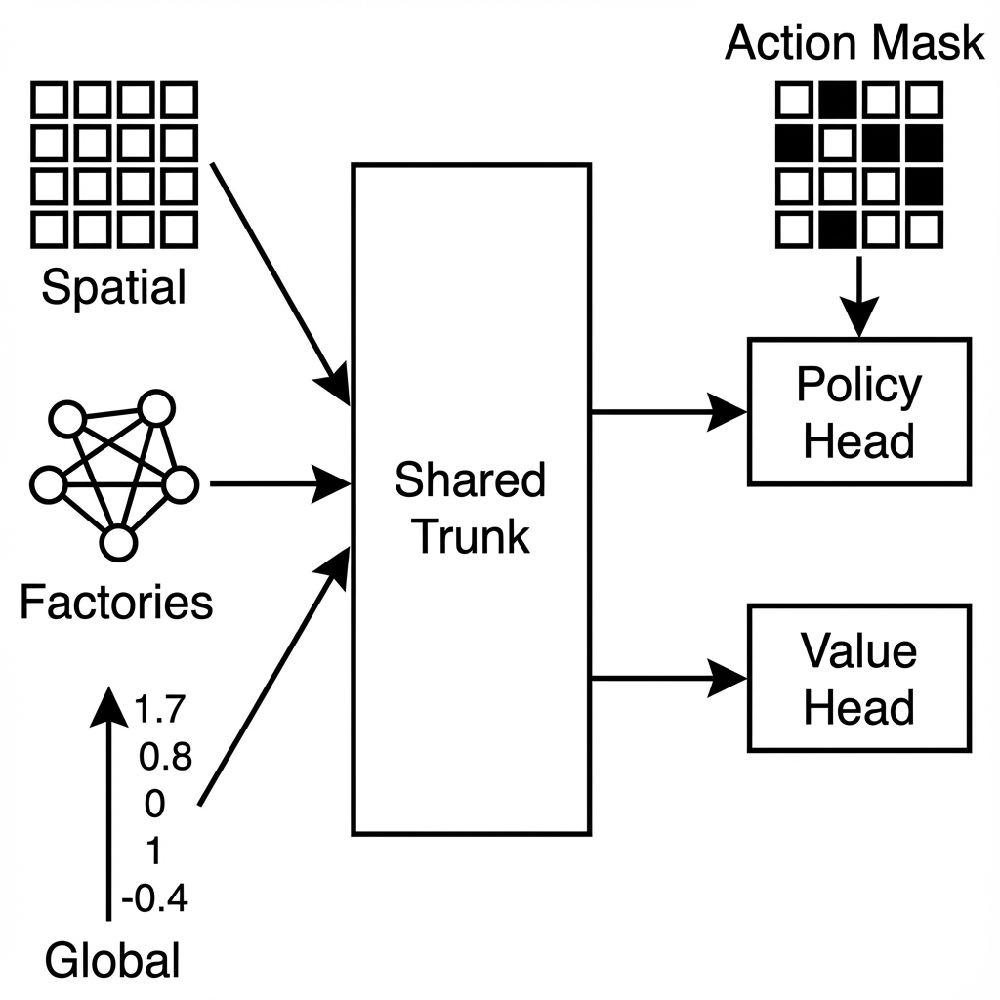

# Arquitectura del modelo AzulNet (Fase 2)

Este documento describe la arquitectura de la red neuronal utilizada en el proyecto Azul Zero, actualizada para la Fase 2 (Noviembre 2025).

## Esquema general

La arquitectura sigue el patrón de AlphaZero pero con adaptaciones específicas para Azul, dividida en tres bloques de entrada y dos cabezas de salida:

- **Entrada Triple**:
    - `x_spatial`: Tablero y estado estructurado (CNN).
    - `x_factories`: Estado de las fábricas (Transformer).
    - `x_global`: Estado global y conteos (MLP).
- **Bloques residuales convolucionales** para la parte espacial.
- **Transformer Encoder** para procesar las fábricas.
- **Cabezas separadas** para política (policy head) y valor (value head).



## Detalle por capas

### Entradas

1.  **`x_spatial`**: Tensor `(batch, in_channels, 5, 5)`. Contiene tableros, muros y líneas de patrón.
2.  **`x_factories`**: Tensor `(batch, N_factories + 1, 5)`. Contiene el conteo de colores en cada fábrica y el centro.
3.  **`x_global`**: Vector `(batch, global_size)`. Contiene bolsa, descartes, puntuaciones, etc.

### Procesamiento de Fábricas (Nuevo en Fase 2)

- **Embedding**: Proyección lineal de 5 colores a `embed_dim` (32).
- **Transformer Encoder**: 2 capas de atención para capturar relaciones entre fábricas.
- **Salida**: Vector aplanado de dimensión `(N+1) * embed_dim`.

### Tronco Espacial (Backbone)

- **Conv Inicial**: 64 canales, kernel 3x3.
- **Bloques Residuales**: 4 bloques estándar (Conv3x3 -> BN -> ReLU -> Conv3x3 -> BN -> Add -> ReLU).

### Rama de Política (Policy Head)

- **Conv2D**: 64→2 canales, kernel 1x1.
- **Concatenación**: Salida espacial aplanada + Salida de fábricas + `x_global`.
- **MLP**:
    - Linear (→ 256) + ReLU
    - Linear (→ `action_size`)
- **Salida**: Logits para cada acción posible.

### Rama de Valor (Value Head)

- **Conv2D**: 64→1 canal, kernel 1x1.
- **Concatenación**: Salida espacial aplanada + Salida de fábricas + `x_global`.
- **MLP**:
    - Linear (→ 256) + ReLU
    - Linear (→ 1)
- **Salida**: **Valor Lineal** (sin activación Tanh). Representa la diferencia de puntos normalizada.

## Diagrama (Mermaid)

```mermaid
graph TD
    subgraph Inputs
        InputSpatial[Spatial (B, 4, 5, 5)]
        InputFactories[Factories (B, 6, 5)]
        InputGlobal[Global (B, 27)]
    end

    subgraph Spatial Processing
        InputSpatial --> ConvIn[Conv2D 3x3 (64)]
        ConvIn --> ResBlocks[4x ResBlocks]
        ResBlocks --> PolicyConv[Policy Conv 1x1 (2)]
        ResBlocks --> ValueConv[Value Conv 1x1 (1)]
        PolicyConv --> FlatSpatialP[Flatten]
        ValueConv --> FlatSpatialV[Flatten]
    end

    subgraph Factory Processing
        InputFactories --> Embed[Linear Embed (32)]
        Embed --> Transformer[Transformer Encoder (2 layers)]
        Transformer --> FlatFactories[Flatten]
    end

    subgraph Heads
        FlatSpatialP & FlatFactories & InputGlobal --> ConcatP[Concat]
        ConcatP --> PolicyFC1[Linear (256) + ReLU]
        PolicyFC1 --> PolicyOut[Linear -> Logits]

        FlatSpatialV & FlatFactories & InputGlobal --> ConcatV[Concat]
        ConcatV --> ValueFC1[Linear (256) + ReLU]
        ValueFC1 --> ValueOut[Linear -> Score Diff]
    end
```

## Cambios respecto a Fase 1

1.  **Value Head Lineal**: Se eliminó `Tanh` para predecir diferencias de puntuación en lugar de probabilidad de victoria binaria.
2.  **Transformer de Fábricas**: Se introdujo atención para procesar las fábricas en lugar de aplanarlas en el vector global.
3.  **Input Estructurado**: Se separaron las entradas en el `forward` de la red.

---
Última actualización: Noviembre de 2025 (Fase 2)