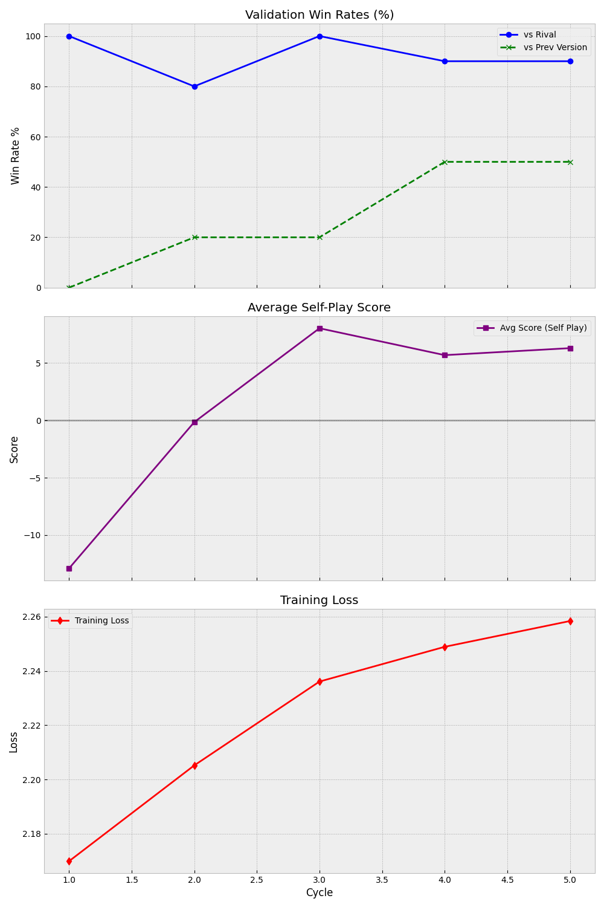

# Informe de Análisis de Entrenamiento
**Fecha:** 2026-01-10
**Ciclo Actual:** 5
**Autor:** Antigravity

---

## 1. Semáforo General
*   🟢 **VERDE**: Progreso saludable.

> El modelo ha superado la fase de "scores negativos". Desde el Ciclo 3, el Score Promedio en Self-Play es positivo (+8.0), indicando que ha abandonado la estrategia de "Suicidio". 
> **Nota de Precaución**: El Win Rate del 90% es contra **RandomPlus** (Fase 1 del Curriculo), no contra Heuristic. Aunque es un buen comienzo, no debemos confiarnos. Lo verdaderamente importante es el **AvgScore positivo** en Self-Play.

---

## 2. Métricas Clave (Ciclos Recientes)

| Ciclo | Rival | WinRate | AvgScore (Tr) | Obs |
| :--- | :--- | :--- | :--- | :--- |
| 3 | RandomPlus | 100.0% | +8.0 | Recuperación. Rival débil. |
| 4 | RandomPlus | 90.0% | +5.7 | Consolidación. |
| 5 | RandomPlus | 90.0% | +6.3 | Estable. |

---

## 3. Análisis de Gráficas (`training_progress.png`)

### Win Rate
*   [x] Tendencia Ascendente / Estable Alta
*   [ ] Estancada
*   [ ] Colapso

**Comentario:** Win Rate alto contra RandomPlus. Esto es lo esperado en la Fase 1 (Re-orientación). El verdadero test vendrá en el Ciclo 6+ cuando el rival cambie a Heuristic.

### Score Absoluto (Self-Play)
*   [x] Positivo y Creciente (Ideal)
*   [ ] Negativo (Suicidio)
*   [ ] Fluctuante

**Comentario:** **CRÍTICO**. El score es positivo (+6.3). Esta es la prueba de fuego que hemos superado. El agente ya no juega a "restar menos que el otro", sino a sumar.

---

## 4. Conclusiones y Acciones

### Diagnóstico
El entrenamiento va bien encaminado. Hemos salido del pozo del suicidio. Ahora el reto será mantener scores positivos cuando la dificultad del rival aumente en el siguiente ciclo.

### Acciones Recomendadas
- [x] **Ninguna (Continuar monitoreo)**.
- [ ] Ejecutar soft-reset (volver a ciclo anterior).
- [ ] Ajustar Hiperparámetros (LR, Exploración).
- [ ] Limpiar Replay Buffer.
- [ ] Detener entrenamiento para investigación.

---

## Anexos
*   [Training Log Analyzed](../../logs_v6/training_analyzed.log)
*   [Training Progress Chart](../../logs_v6/training_progress.png)

